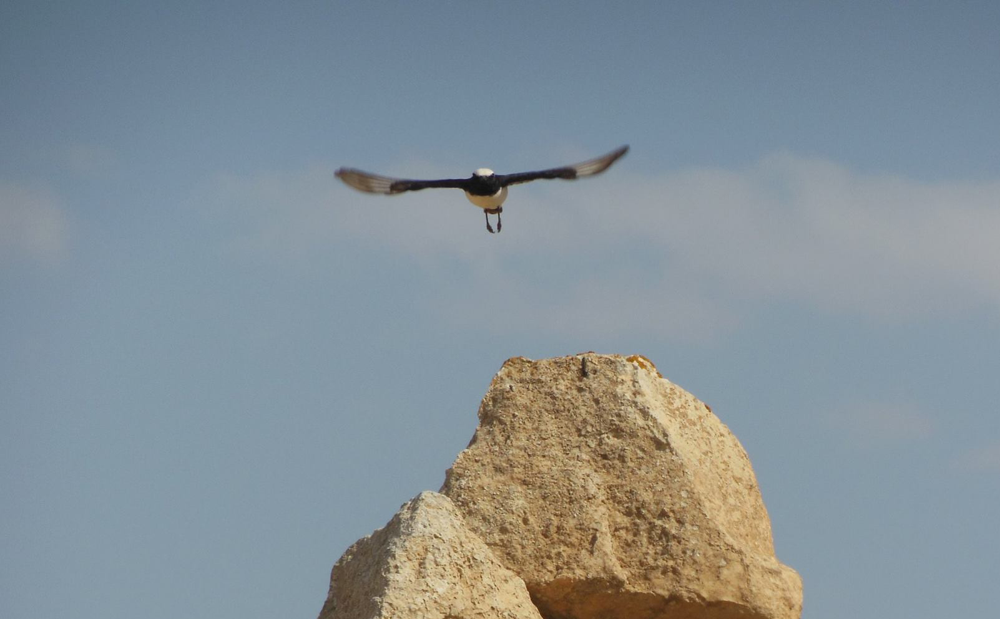

+++
description = "Intro"
author = "George Pacheco"
+++

### Welcome.


<blockquote>
I am an Evolutionary Biologist <b>currently</b> doing a post-doc at the <a href="https://www.dtu.dk/english"><i>Technical University of Denmark</i></a> being advised by <a href="https://orbit.dtu.dk/en/persons/jakob-hemmer-hansen">Dr. Jakob Hemmer Hansen</a> & <a href="https://orbit.dtu.dk/en/persons/dorte-bekkevold">Dr. Dorte Bekkevold</a>. We belong to the <a href="https://www.aqua.dtu.dk/english/Research/Population_genetics">Population Genetics Section</a>, which is located at the small town of Silkeborg in Jutland. This section is part of <a href="https://www.aqua.dtu.dk/english/about">DTU Aqua</a>, a well-known institute in the field of aquatic resources.
 
My project involves 
</blockquote>

<blockquote>
<b>Previously</b>, I did my MSc and PhD in at the <a href="https://snm.ku.dk/english/"><i>Natural History Museum of Denmark</i></a> — <a href="https://www.ku.dk/english/"><i>University of Copenhagen</i></a> under the supervision of <a href="(https://globe.ku.dk/staff-list/?pure=en/persons/295003">Prof. Tom Gilbert</a> & co-advised by <a href="https://scholar.google.com/citations?user=gvZmPNQAAAAJ&hl=en">Dr. Filipe Vieira</a>.
</blockquote>




  

    
    <figcaption><strong>Bird in Israel.</strong></figcaption>
  

  

    
    <figcaption><strong>Bird in Israel.</strong></figcaption>
  



***